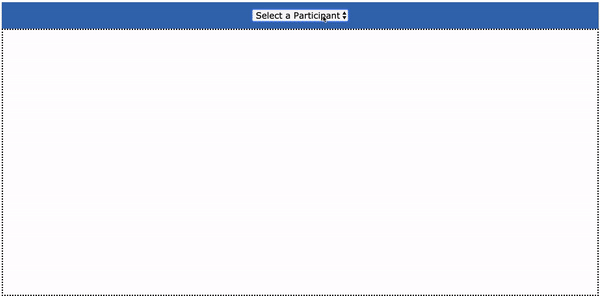

# Flatacalories
Today you'll be building an app for counting calories!! You will be using a local API and building out the frontend for our app, Flatacalories.

## Demo
Use this gif as an example of how the app should work.

## Setup

- Fork and clone this repository
- Run `json-server --watch db.json` to get the backend started
- Open the `index.html` file on your browser

## Endpoints

Your base URL for your API will be: http://localhost:3000

The endpoints you will need are:

- GET `/characters`
- GET `/characters/:id`
- PATCH `/characters/:id`

## Core Deliverables

As a user, I can:

1. See all character's name in the dropdown menu by **requesting** data from the server

2. Select a character from drop down menu and see character's info inside `#detailed-info` div. 

3. Clicks on "Add Calories" button to add calories to a Character. Persist calories value to the server and update the DOM.

## Advanced Deliverables

These deliverables are not required to pass the code challenge, but if you have the extra time, or even after the code challenge, they are a great way to stretch your skills. Consider refactoring your current code before moving on.

> Note: If you are going to attempt these advanced deliverables, please be sure to have a working commit with all the Core Deliverables first!

As a user, I can:
- Clicks on a `Reset Calories` button to set calories to `0`. Persist calories value to the server and update the DOM.
- Change character's name
- Add a new character

## Rubric

### DOM Manipulation

1. Did not properly render elements to the DOM.

2. Rendered elements to the DOM, but with some errors.

3. Successfully rendered and updated the DOM as described by the Core Deliverables.

4. Structured HTML creation code cleanly and in a reusable way, using a semantically correct HTML structure without any unnecessary elements.

5. All of the above, plus completed at least one Advanced Deliverable.

### Events

1. Did not attach event listeners to respond to events.

2. Attached event listeners, but incompletely or with some errors.

3. Successfully attached event listeners to handle DOM events and met all of the Core Deliverables.

4. Structured code in a clean and reusable way, splitting functions, using descriptive names and using target properties effectively.

5. All of the above, plus completed at least one Advanced Deliverable.

### Communication with the Server

1. Unable to communicate with the server.

2. Partially able to communicate with the server, but incompletely or with some errors.

3. Able to perform a GET and a non-GET request successfully. All Core Deliverables met.

4. Code structured in a clean and reusable way, splitting into functions and reusing them where needed, with clear function and variable naming.

5. All of the above, plus completed at least one Advanced Deliverable.
